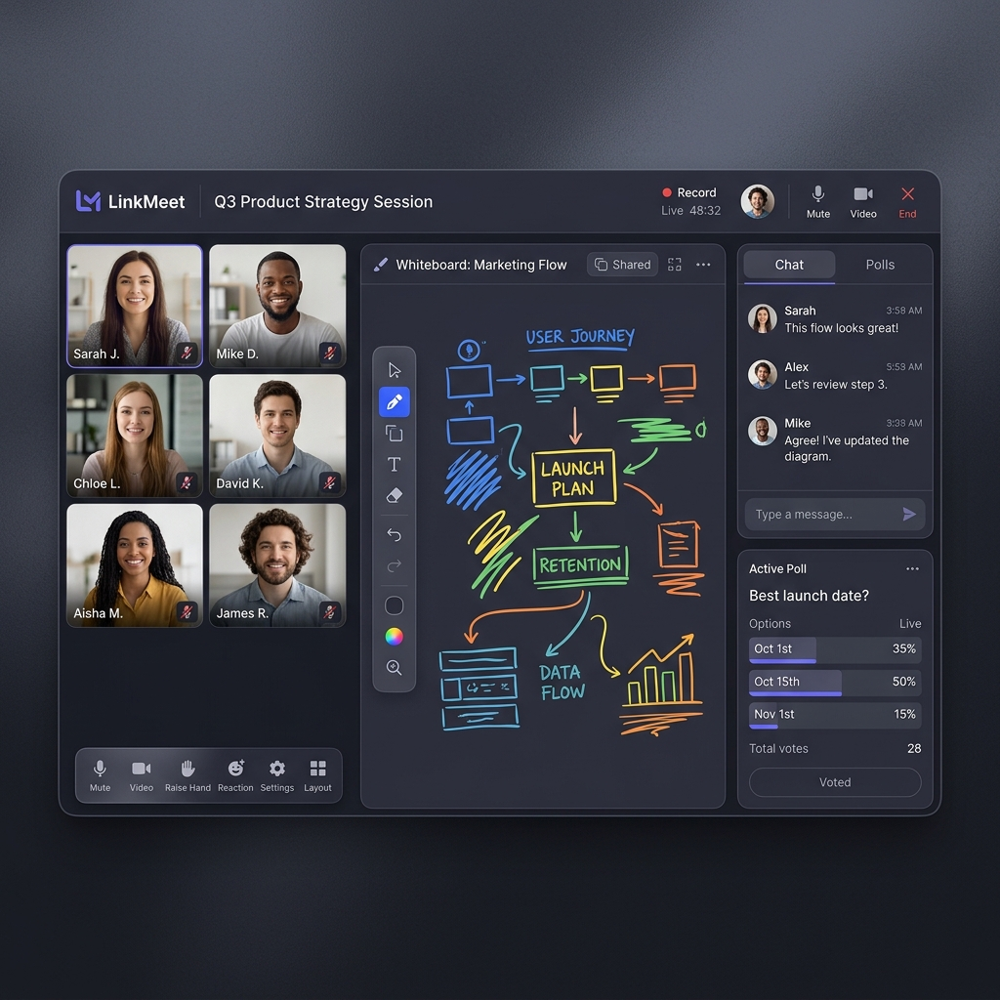
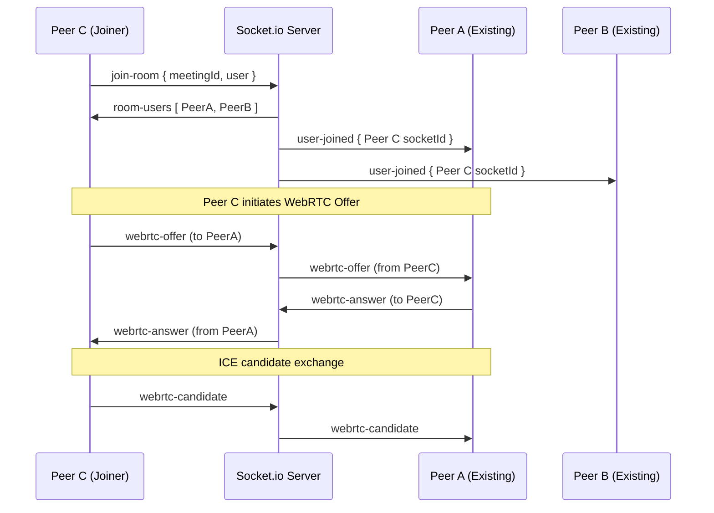

# 🌐 LinkMeet — MERN Real-Time Communication Platform

<p align="center">
  
</p>

<p align="center">
  <strong>A premium, high-fidelity real-time video conferencing, collaborative whiteboard, and team communication platform.</strong>
</p>

<p align="center">
  
  
  
  
  
</p>

---

## 🚀 Key Features

LinkMeet is packed with collaboration and moderation features designed to deliver a complete workspace environment:

| Feature | Description |
| :--- | :--- |
| **📞 High-Fidelity Conferencing** | Multi-peer mesh WebRTC audio & video streaming with remote microphone/camera toggles. |
| **🎨 Interactive Whiteboard** | Collaborative drawing board synced instantly via WebSockets, featuring brush sizing, custom colors, and eraser tools. |
| **💬 Room Chat & Emojis** | Live database-logged room chat boards featuring quick emoji shortcut selection. |
| **📊 Live Polls** | Hosts can launch dynamic multiple-choice polls; votes are tallied and displayed in real-time. |
| **📁 Document Sharing** | Fast asset/slide uploads with fallback to local server directory storage if Cloudinary is offline. |
| **🚪 Waiting Room** | Attendee lobby queue where moderators/hosts approve or deny admittance requests. |
| **🛡️ Moderator Controls** | Full host capabilities to mute participants' audio tracks or kick disruptive users from calls. |
| **✨ Advanced Add-ons** | AI-generated meeting summaries, live Speech-to-Text captions (CC), hand raising, and emoji reactions. |

---

## 🛠️ Tech Stack

- **Frontend**: React (Vite), Tailwind CSS (slate-violet dark mode theme), Lucide Icons, Axios, Socket.io-client.
- **Backend**: Node.js, Express.js, Socket.io (Signaling & Sync), Mongoose (MongoDB).
- **Media & Signaling**: WebRTC Mesh Topology for peer-to-peer audio/video.
- **Authentication**: JSON Web Tokens (JWT) + Bcrypt.js for hashing.
- **Asset Storage**: Cloudinary for file uploads with disk-storage fallbacks.

---

## 📂 Project Structure

```text
CodeAlpha_LinkMeet/
├── backend/
│   ├── config/          # Database connector & Cloudinary API configuration
│   ├── controllers/     # Controller logic (authentication, meetings, messages, uploads)
│   ├── middleware/      # Authentication shields & Multer file handling
│   ├── models/          # Mongoose Schemas (User, Meeting, Message, File, Notification)
│   ├── routes/          # Express route paths mapping
│   ├── sockets/         # Socket.io signaling & state synchronization logic
│   ├── server.js        # Main entrypoint script
│   └── seed.js          # Database mock data seeder
│
├── frontend/
│   ├── src/
│   │   ├── components/  # Core widgets (ChatPanel, ParticipantsList, PollSystem, Whiteboard, WaitingRoom)
│   │   ├── context/     # Global React Contexts (AuthContext, SocketContext, ThemeContext)
│   │   ├── pages/       # Layout pages (Home, Login, Register, Dashboard, MeetingRoom, Profile)
│   │   ├── App.jsx      # Navigation routing and layout definitions
│   │   └── main.jsx     # Virtual DOM mount point
│   ├── index.html       # HTML entry shell
│   ├── vite.config.js   # Dev proxy & build configuration
│   └── tailwind.config  # Tailwind UI accent configurations
│
└── README.md
```

---

## 💻 Installation & Local Setup

### Prerequisites
* [Node.js](https://nodejs.org/) (v18+)
* [MongoDB](https://www.mongodb.com/) (Local installation or Atlas URI Connection String)

### 1. Backend Setup
1. Navigate to the backend directory:
   ```bash
   cd backend
   ```
2. Install all dependencies:
   ```bash
   npm install
   ```
3. Create a `.env` file in the `backend/` root directory and set the variables:
   ```env
   PORT=5000
   MONGODB_URI=your_mongodb_connection_string
   JWT_SECRET=your_super_secure_jwt_secret_key
   CLOUDINARY_CLOUD_NAME=your_cloudinary_name
   CLOUDINARY_API_KEY=your_cloudinary_key
   CLOUDINARY_API_SECRET=your_cloudinary_secret
   ```
4. **Seed the database** (Creates mock users for testing):
   ```bash
   npm run seed
   ```
   *Creates mock credentials: `alex@example.com` or `sarah@example.com` with password `password123`.*
5. Launch the backend server in development mode:
   ```bash
   npm run dev
   ```

### 2. Frontend Setup
1. Navigate to the frontend directory:
   ```bash
   cd ../frontend
   ```
2. Install all dependencies:
   ```bash
   npm install
   ```
3. Run the frontend application:
   ```bash
   npm run dev
   ```
4. Open your browser and navigate to [http://localhost:5173](http://localhost:5173).

---

## 🛰️ Architecture & Signaling Flow

LinkMeet implements a fully decentralized **peer-to-peer Mesh Topology** for audio and video transmission. Socket.io serves as the orchestrator for exchanging peer configuration offers, answers, and candidates:



---

## 🌐 Deployment Guide

### Backend (Render / Heroku)
1. Push your repository to GitHub.
2. Link your repository to **Render** and create a new **Web Service**.
3. Configure the environment:
   * **Root Directory**: `backend`
   * **Build Command**: `npm install`
   * **Start Command**: `node server.js`
4. Set all Environment Variables in the service settings.

### Frontend (Vercel / Netlify)
1. In Vercel, import your GitHub repository.
2. Set the framework preset to **Vite**.
3. Choose the **Root Directory** as `frontend`.
4. Set the **Build Command** as `npm run build` and **Output Directory** as `dist`.
5. Add client routing fallback rewrite `vercel.json` if needed:
   ```json
   {
     "rewrites": [{ "source": "/(.*)", "destination": "/index.html" }]
   }
   ```

---

## 🛡️ Troubleshooting & Security

### 🔑 JsonWebTokenError: invalid signature
If you see a `JsonWebTokenError: invalid signature` log in the backend console, it means the incoming request's Authorization header contains a token signed with a different key than your current `JWT_SECRET`.
* **Fix**: Ensure your backend's `.env` has a consistent `JWT_SECRET`. If you change this value, clear your browser cookies/localStorage to discard old client-side tokens and log in again to issue a fresh signature.

### 🖼️ Cloudinary Upload Failures
If Cloudinary configuration parameters are missing or invalid, upload requests will automatically fallback to storing assets in a local directory (`backend/uploads`) without breaking the app flow.
